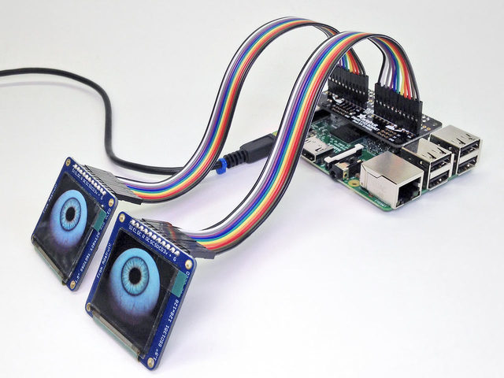

# Tiki Eyes

## Using Adafruit's Animated Snake Eyes Bonnet for Raspberry Pi to bring a tiki to life.

One of my brothers got me an electronics kit for Christmas, which is always exciting though it has the potential to be a dangerous gift, in that it requires work on the part of the receiver. I've let a few other generous gifts of similar nature languish on my shelf for years, staring guilt-inducingly at me while they gather dust. So I was determined to get this kit put together before the holidays were over.

The kit was for a pair of [animated eyes controlled through a custom bonnet and two small displays](https://learn.adafruit.com/animated-snake-eyes-bonnet-for-raspberry-pi/), and it comes with a clear, thorough guide.

Assembling the hardware wasn't hard: the kit came with a set of headers for the bonnet and for the displays, which are basically pins that can be soldered on to boards so that jumper wires that are easy to remove can be used for connections.

(This makes sense when you're prototyping something, or when you don't want to consign a piece of hardware to one task for the rest of its life. For me, projects always end up in a funny middle ground: I build them as if I were prototyping them, but end up leaving them in a more or less permanent installation once I've got something I like. At which point the choice to use header pins instead of soldered connections makes them unnecessarily fragile. Maybe more experience will start to break this habit—if I were more sure what I wanted before I began a project I'd be willing to jump straight to soldering. But I tend to always prioritize freedom in my projects and hate being locked into a choice before I'm sure about it.)

I'm no expert at soldering, but I've attached header pins to a couple of Pi Zeros and other boards, and at this point attaching headers is mostly just fun. The only issues I know to worry about are making sure there's _enough_ solder to make a connection, and not so much that it bridges two pins together.

Some initial things that surprised me: I wasn't going to get to use the free Pi Zero I had on hand, because the eye animation actually needs some decent processor power. Also, I was going to have to devote a Pi to the eyes, as the guide requires a specific OS, custom-fitted for the task. It's designed to work on start-up, so without customization it really requires a Pi that's not going to be doing anything else. I had an older Pi 3B on hand whose job is being taken over by a Pi 4, so that wasn't a problem.

`video: title: "Tiki eyes": ./trying-out-the-eyes.mp4`

<video width="320" height="240" controls>
  <source src="./trying-out-the-eyes.mp4" type="video/mp4">
Your browser does not support the video tag.
</video>
